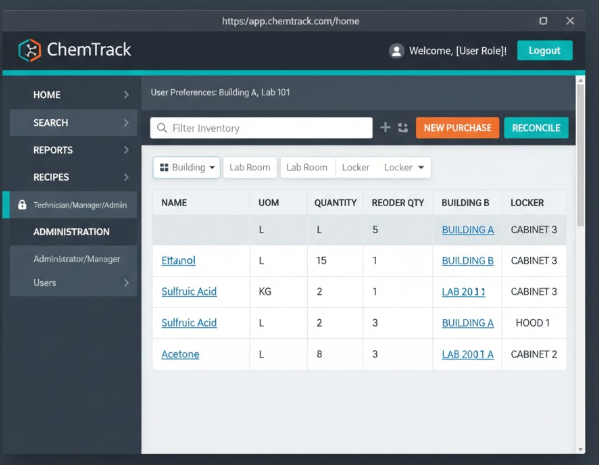
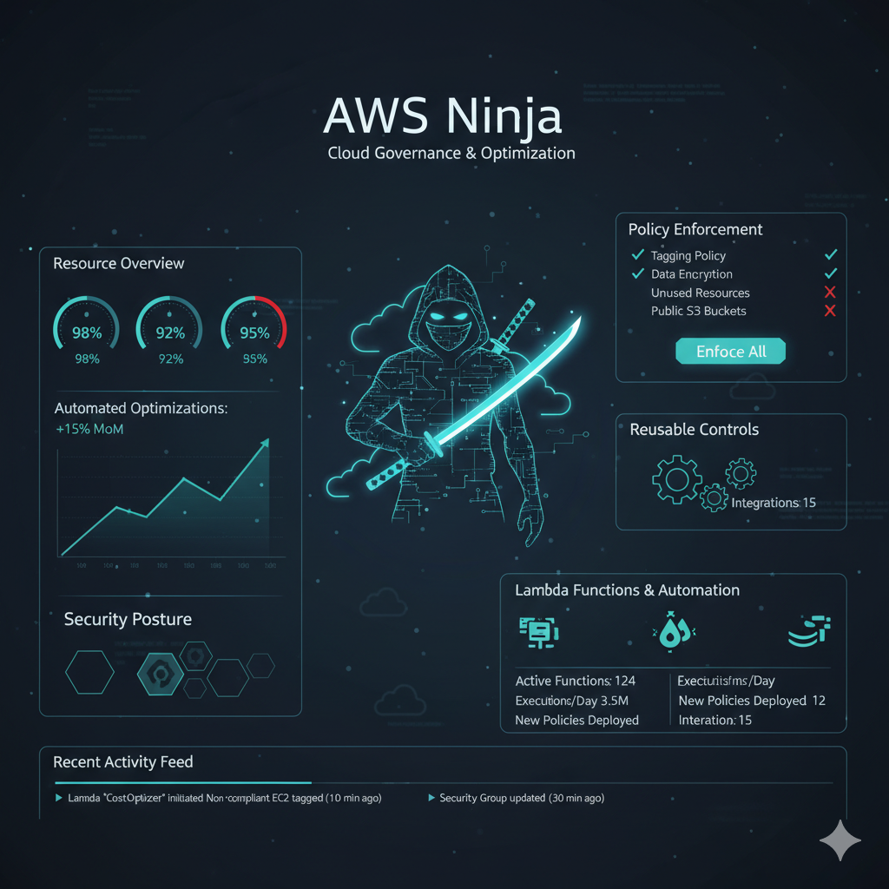

<!-- Hero Banner -->

  

<!-- Typing Animation -->
<!-- Typing Animation -->

  

  
  
  

---

## 👋 Hey, I’m Vishnu

I’m a **Cloud & DevOps Engineer** with **5+ years** of experience designing and automating **secure, resilient, and scalable** infrastructure across **AWS** and **Azure**.

I love:
- Turning **manual runbooks** into **idempotent Terraform/Ansible modules**
- Shipping **production-ready CI/CD** with **DevSecOps** baked in
- Building **Kubernetes platforms** that are observable, cost-optimized, and boringly reliable  

> _“If it’s done twice, it gets automated.”_  

---

## 🔗 Quick Links

  
  
  
  

---

## 📊 GitHub Telemetry

  
 

  

  

---

## 🧠 Cloud & DevOps Skill Map

### ☁️ Cloud & Platform Engineering
- **AWS:** EC2, S3, RDS, Lambda, API Gateway, ECR, Route 53, CloudWatch, KMS, DynamoDB
- **Azure:** Blob Storage, Functions, CDN, Redis Cache
- **Kubernetes:** EKS, AKS, Helm, Rancher, Operators, distroless images, GitOps (Argo CD)

### 🛠 Infrastructure as Code & Automation
- **Terraform** (reusable modules, multi-env blueprints)  
- **Ansible** (DR automation, configuration management)  
- **CloudFormation**, **GitOps**, **Boto3**, **Shell scripting**, **Groovy**

### 🚀 CI/CD & DevSecOps
- Jenkins · GitLab CI · Harness · GitOps
- Trivy · SonarQube · Nexus · Docker · Canary & Blue/Green deployments
- Secure pipelines with static analysis, unit-test gates, image & secrets scanning

### 📈 Observability & Reliability
- **Prometheus & Grafana** dashboards and alerts  
- OpenTelemetry-based SLI/SLO tracking  
- ELK, Kafka, Kinesis, CloudWatch, custom platform health dashboards  

### 💻 Application & Data
- React · Node.js · Express · REST APIs  
- Python (Pandas, automation scripts)  
- SQL · MySQL · Oracle · DynamoDB  

---

## 🧪 Featured Projects (with eye-candy)

> 💡 _Tip: Add your screenshots (like `p1.png`, `p2.png`, etc.) in this repo’s `/assets` folder and adjust the paths below._

### 1️⃣ Production-Grade DevSecOps Pipeline

  

- End-to-end **DevSecOps** pipeline for containerized apps  
- **Security gates** for SAST, unit tests, image & secrets scanning before deployment  
- Stack: **GitLab CI · Trivy · SonarQube · Nexus · ECR · Argo CD**  
- Repo: 👉 [DevSecOps Personal Pipeline](https://github.com/VishnuKosuri12/Devsecops-personal-pipeline)

---

### 2️⃣ AI Prompt Engineer – ChemTrack on AWS

  

- **Chem tracking application** powered by **AWS Bedrock + LLMs**  
- Serverless backend with **Lambda + API Gateway + DynamoDB**, auth via **Cognito**  
- Event-driven design with governance and auditability baked in  
- Repo: 👉 [AI Prompt Project](https://github.com/VishnuKosuri12/AI-prompt-project)

---

### 3️⃣ AWS Ninja – Infrastructure Governance Automation

  

- **Python-based compliance engine** that auto-detects drift against policy  
- Uses **S3 + Lambda + Boto3** to scan and remediate non-compliant resources  
- Governance dashboard themed as **“AWS Ninja”** for quick posture insights  
- Repo: 👉 [Ninja Governance Automation](https://github.com/VishnuKosuri12/Ninja-Governance)

---

### 4️⃣ Wild Rydes – Serverless Ride-Sharing App

  

- **Unicorn-themed ride sharing** app built as a serverless reference architecture  
- Backend with **Lambda, API Gateway, DynamoDB**, identity via **Cognito (OIDC/OAuth2)**  
- Deployed with **Amplify**, instrumented for cloud-native observability  
- Repo: 👉 [Wild Rydes Site](https://github.com/VishnuKosuri12/wildrydes-site)

---

### 5️⃣ ML Pipeline – Flight Delay / Anomaly Detection

- End-to-end **streaming + ML** stack with AWS  
- Services: **S3, Glue, SageMaker, Kinesis, Step Functions**  
- Focus on **feature engineering, hyper-parameter tuning, and anomaly detection**  
- Repo: 👉 [ML for Flight Delays](https://github.com/VishnuKosuri12/ML-for-Flight-Delays)

---

## 🎓 Certifications

  
  
  
  
  

---

## 🧷 Mini Dashboard: Impact Highlights

- 🧱 Built **Kubernetes operators** to rotate container certificates with **0 downtime**, improving process efficiency by **15%**  
- 💸 Trained teams on AWS best practices, driving **18% YoY** cloud cost savings  
- 🧩 Standardized infra with **Terraform modules**, boosting development velocity by **90%**  
- 🛡 Hardened infra and introduced **ITDR on S3**, reducing vulnerabilities by **99.99%**  
- 📉 Cut recurring production incidents by **30%** via RCA + automated runbooks  
- ⏱ Automated DR site creation with Ansible, improving **RTO by 95%**  

---

## 🤝 Let’s Build Something Reliable

If you’re working on **cloud migrations, platform engineering, Kubernetes modernization, or DevSecOps** and want someone who obsesses over **uptime, simplicity, and automation**, feel free to reach out.

  

  

